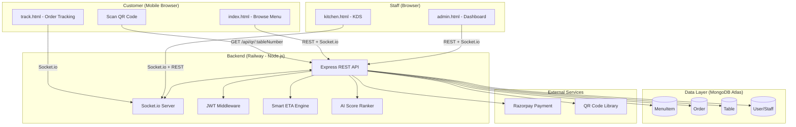
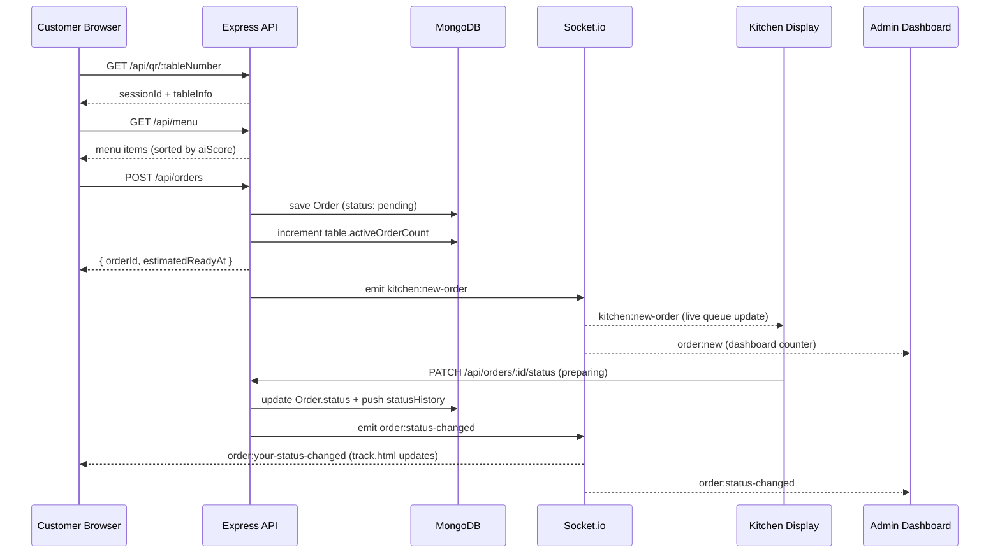
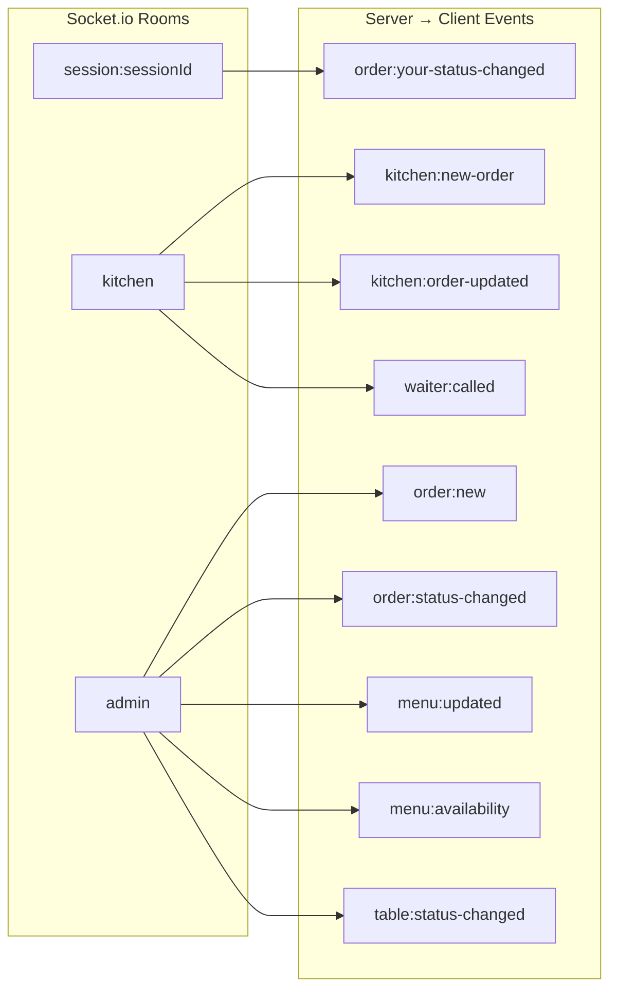

# Design Document: TableQR — Smart Restaurant Ordering System

## Overview

TableQR is a production-ready QR-based restaurant ordering platform that enables customers to scan a table QR code, browse the menu, place orders, and track them in real-time — all without a native app. Staff interact through a Kitchen Display System (KDS) and an admin dashboard that surfaces live analytics, revenue charts, and crowd heatmaps. The system is built on Node.js + Express + Socket.io with MongoDB for persistence and Vanilla JS for the frontend, targeting mobile-first customers and desktop-first staff.

The platform is designed around three distinct user contexts: the customer ordering flow (anonymous, session-based), the kitchen staff flow (authenticated, real-time queue management), and the admin flow (authenticated, analytics and configuration). Real-time synchronization across all three contexts is handled exclusively via Socket.io, ensuring that a status change in the kitchen is immediately reflected on the customer's tracking page and the admin dashboard.

The architecture prioritizes horizontal scalability on Railway (backend) and Vercel (frontend) with MongoDB Atlas as the managed data layer. JWT-based authentication secures all staff-facing routes while customer-facing routes are protected by session tokens tied to table QR scans.


## Architecture

### System Overview



### Request Flow — Customer Order Placement



### Real-time Event Architecture




## Components and Interfaces

### Component 1: Auth Module (`routes/auth.js` + `middleware/authMiddleware.js`)

**Purpose**: Handles staff registration, login, and JWT-based route protection.

**Interface**:
```javascript
// Routes
POST /api/auth/register  // body: { name, email, password, role }
POST /api/auth/login     // body: { email, password } → { token, user }
GET  /api/auth/me        // header: Authorization: Bearer <token> → user profile

// Middleware
protect(req, res, next)           // verifies JWT, attaches req.user
authorize(...roles)(req, res, next) // checks req.user.role against allowed roles
```

**Responsibilities**:
- Hash passwords with bcrypt (12 rounds) on registration
- Issue signed JWT on login (payload: userId, role, exp)
- Validate token on every protected request
- Enforce role-based access (admin vs kitchen vs waiter)

---

### Component 2: Menu Module (`routes/menu.js`)

**Purpose**: Full CRUD for menu items plus AI-score-based recommendations.

**Interface**:
```javascript
GET    /api/menu                        // public → MenuItem[]
GET    /api/menu/recommendations        // public → MenuItem[] sorted by aiScore desc
GET    /api/menu/categories             // public → string[]
POST   /api/menu                        // admin → create MenuItem
PUT    /api/menu/:id                    // admin → replace MenuItem
PATCH  /api/menu/:id/availability       // admin/kitchen → { isAvailable: boolean }
DELETE /api/menu/:id                    // admin → soft/hard delete
```

**Responsibilities**:
- Return only `isAvailable: true` items to customers
- Emit `menu:updated` / `menu:availability` Socket.io events on mutations
- Compute and persist `aiScore` based on order frequency, ratings, and recency

---

### Component 3: Orders Module (`routes/orders.js`)

**Purpose**: Order lifecycle management from placement to completion.

**Interface**:
```javascript
POST   /api/orders                      // customer (session) → place order
GET    /api/orders                      // kitchen/admin → all orders (filterable)
GET    /api/orders/active               // kitchen → pending + preparing orders
GET    /api/orders/table/:num           // kitchen/admin → orders for a table
GET    /api/orders/:id                  // any → single order detail
PATCH  /api/orders/:id/status           // kitchen/admin → { status }
POST   /api/orders/:id/rating           // customer → { rating, ratingComment }
```

**Responsibilities**:
- Validate session ownership before order placement
- Compute `estimatedReadyAt` via Smart ETA engine
- Append to `statusHistory` on every status transition
- Emit Socket.io events to kitchen, admin, and customer session rooms
- Update `table.activeOrderCount` on order completion/cancellation

---

### Component 4: Tables Module (`routes/tables.js`)

**Purpose**: Table lifecycle and QR session management.

**Interface**:
```javascript
GET    /api/tables                      // admin → Table[]
PATCH  /api/tables/:num/status          // admin/waiter → { status }
POST   /api/tables/initialize           // admin → bulk create tables
```

**Responsibilities**:
- Generate and store QR code URL per table on initialization
- Manage `currentSessionId` rotation when table is cleared
- Track `activeOrderCount` and `status` (available/occupied/reserved/cleaning)

---

### Component 5: Analytics Module (`routes/analytics.js`)

**Purpose**: Aggregated KPIs and chart data for the admin dashboard.

**Interface**:
```javascript
GET /api/analytics/dashboard    // admin → { totalOrders, revenue, avgOrderValue, activeOrders }
GET /api/analytics/popular      // admin → MenuItem[] ranked by order frequency
GET /api/analytics/revenue-chart // admin → [{ date, revenue }] for last N days
GET /api/analytics/crowd        // admin → [{ tableNumber, orderCount, lastActivity }]
```

**Responsibilities**:
- Aggregate from Order collection using MongoDB aggregation pipelines
- Support time-range filtering (today, week, month)
- Crowd heatmap data derived from `table.activeOrderCount` + recent order timestamps

---

### Component 6: QR Module (`routes/qr.js` + `qr-generator/generate.js`)

**Purpose**: On-demand and batch QR code generation for tables.

**Interface**:
```javascript
GET  /api/qr/:tableNumber       // public → { qrCodeDataUrl, sessionId, tableInfo }
POST /api/qr/generate-all       // admin → generates PNG files for all tables
```

**Responsibilities**:
- Encode table URL (`/index.html?table=N&session=<uuid>`) into QR image
- Return base64 data URL for inline display or PNG for print
- Batch generator writes PNGs to `qr-generator/output/`

---

### Component 7: Socket Manager (`socket/socketManager.js`)

**Purpose**: Centralizes all Socket.io event registration and room management.

**Interface**:
```javascript
initializeSocket(io)  // called once at server startup

// Client → Server events handled:
// join:session    { sessionId, tableNumber }
// join:kitchen    { token }
// join:admin      { token }
// kitchen:update-status  { orderId, status }
// customer:call-waiter   { sessionId, tableNumber }
```

**Responsibilities**:
- Authenticate `join:kitchen` and `join:admin` via JWT before room admission
- Map sessionId → socket for targeted customer notifications
- Delegate status updates to order service (single source of truth)
- Broadcast to appropriate rooms on all state changes


## Data Models

### MenuItem

```javascript
{
  name: String,              // required, trimmed
  description: String,
  price: Number,             // required, min: 0
  category: String,          // required
  emoji: String,
  image: String,             // URL
  tags: [String],
  isVeg: Boolean,            // default: false
  isAvailable: Boolean,      // default: true
  preparationTime: Number,   // minutes, default: 15
  calories: Number,
  allergens: [String],
  aiScore: Number,           // 0–100, computed
  stats: {
    totalOrdered: Number,
    totalRevenue: Number,
    avgRating: Number,
    ratingCount: Number
  },
  sortOrder: Number          // manual override for display order
}
```

**Validation Rules**:
- `price` must be >= 0
- `preparationTime` must be > 0
- `aiScore` clamped to [0, 100]
- `category` must match a known category enum or be a non-empty string

---

### Order

```javascript
{
  orderId: String,           // human-readable, e.g. "ORD-20240115-0042"
  tableNumber: Number,       // required
  sessionId: String,         // UUID, ties order to table session
  items: [{
    menuItem: ObjectId,      // ref: MenuItem
    name: String,            // snapshot at order time
    price: Number,           // snapshot at order time
    quantity: Number,        // min: 1
    specialNote: String
  }],
  specialInstructions: String,
  subtotal: Number,
  gst: Number,               // computed: subtotal * 0.05 (or configured rate)
  total: Number,             // subtotal + gst
  status: String,            // enum: pending|preparing|ready|served|cancelled
  priority: String,          // enum: normal|high|urgent, default: normal
  statusHistory: [{
    status: String,
    timestamp: Date,
    updatedBy: ObjectId      // ref: User (null for customer actions)
  }],
  estimatedReadyAt: Date,
  servedAt: Date,
  paymentMethod: String,     // enum: cash|card|upi|razorpay
  paymentStatus: String,     // enum: pending|paid|failed|refunded
  paymentRef: String,        // Razorpay order/payment ID
  rating: Number,            // 1–5
  ratingComment: String,
  createdAt: Date,
  updatedAt: Date
}
```

**Validation Rules**:
- `items` array must have at least 1 item
- `quantity` per item must be >= 1
- `status` transitions must follow: pending → preparing → ready → served (cancellation allowed from pending/preparing)
- `rating` must be in [1, 5] if provided

---

### Table

```javascript
{
  tableNumber: Number,       // required, unique
  capacity: Number,          // required, min: 1
  status: String,            // enum: available|occupied|reserved|cleaning
  currentSessionId: String,  // UUID, rotated on table clear
  qrCode: String,            // base64 data URL or file path
  location: String,          // e.g. "indoor", "outdoor", "terrace"
  activeOrderCount: Number,  // default: 0
  createdAt: Date,
  updatedAt: Date
}
```

---

### User (Staff)

```javascript
{
  name: String,              // required
  email: String,             // required, unique, lowercase
  password: String,          // bcrypt hash, never returned in responses
  role: String,              // enum: admin|kitchen|waiter
  isActive: Boolean,         // default: true
  lastLogin: Date,
  createdAt: Date,
  updatedAt: Date
}
```

**Validation Rules**:
- `email` must be valid format and unique
- `password` minimum 8 characters (before hashing)
- `role` must be one of the defined enum values


## Algorithmic Pseudocode

### Smart ETA Engine (`utils/orderUtils.js`)

```pascal
ALGORITHM computeEstimatedReadyAt(newOrder)
INPUT: newOrder — the newly placed Order document
OUTPUT: estimatedReadyAt — Date

BEGIN
  // Step 1: Get max prep time of items in this order
  maxItemPrepTime ← 0
  FOR each item IN newOrder.items DO
    menuItem ← MenuItem.findById(item.menuItemId)
    IF menuItem.preparationTime > maxItemPrepTime THEN
      maxItemPrepTime ← menuItem.preparationTime
    END IF
  END FOR

  // Step 2: Count active kitchen load (pending + preparing orders)
  activeOrders ← Order.count({ status: { IN: [pending, preparing] } })

  // Step 3: Compute load factor
  // Each concurrent order adds a proportional delay
  IF activeOrders <= 2 THEN
    loadFactor ← 1.0
  ELSE IF activeOrders <= 5 THEN
    loadFactor ← 1.25
  ELSE IF activeOrders <= 10 THEN
    loadFactor ← 1.5
  ELSE
    loadFactor ← 2.0
  END IF

  // Step 4: Apply priority boost (high/urgent orders skip ahead)
  IF newOrder.priority = urgent THEN
    priorityMultiplier ← 0.7
  ELSE IF newOrder.priority = high THEN
    priorityMultiplier ← 0.85
  ELSE
    priorityMultiplier ← 1.0
  END IF

  // Step 5: Compute final ETA
  etaMinutes ← maxItemPrepTime * loadFactor * priorityMultiplier
  estimatedReadyAt ← now() + etaMinutes (in minutes)

  RETURN estimatedReadyAt
END
```

**Preconditions**:
- `newOrder.items` is non-empty
- All `menuItemId` references resolve to existing MenuItems
- `newOrder.priority` is one of: normal, high, urgent

**Postconditions**:
- `estimatedReadyAt` is always in the future (>= now + 1 minute)
- ETA increases monotonically with kitchen load
- Urgent orders always have a shorter ETA than normal orders under the same load

**Loop Invariants**:
- `maxItemPrepTime` always holds the maximum prep time seen so far across processed items

---

### AI Score Computation (`utils/orderUtils.js`)

```pascal
ALGORITHM computeAiScore(menuItemId)
INPUT: menuItemId — ObjectId
OUTPUT: aiScore — Number in [0, 100]

BEGIN
  item ← MenuItem.findById(menuItemId)
  stats ← item.stats

  // Normalize each signal to [0, 1]
  // Order frequency signal (cap at 500 orders for normalization)
  freqScore ← MIN(stats.totalOrdered / 500, 1.0)

  // Rating signal
  IF stats.ratingCount = 0 THEN
    ratingScore ← 0.5   // neutral prior
  ELSE
    ratingScore ← (stats.avgRating - 1) / 4   // maps [1,5] → [0,1]
  END IF

  // Recency signal: orders in last 7 days
  recentOrders ← Order.count({
    items.menuItem: menuItemId,
    createdAt: { GTE: now() - 7 days }
  })
  recencyScore ← MIN(recentOrders / 50, 1.0)

  // Weighted combination
  aiScore ← (freqScore * 0.4) + (ratingScore * 0.4) + (recencyScore * 0.2)
  aiScore ← ROUND(aiScore * 100)

  RETURN aiScore
END
```

**Preconditions**:
- `menuItemId` resolves to an existing MenuItem
- `stats.avgRating` is in [1, 5] or stats.ratingCount is 0

**Postconditions**:
- Result is always in [0, 100]
- Items with no orders and no ratings receive a score of 20 (neutral: 0.5 rating * 0.4 weight * 100)

---

### Order Status Transition Validator

```pascal
ALGORITHM validateStatusTransition(currentStatus, newStatus)
INPUT: currentStatus — string, newStatus — string
OUTPUT: isValid — boolean

BEGIN
  allowedTransitions ← {
    pending:    [preparing, cancelled],
    preparing:  [ready, cancelled],
    ready:      [served],
    served:     [],
    cancelled:  []
  }

  IF newStatus IN allowedTransitions[currentStatus] THEN
    RETURN true
  ELSE
    RETURN false
  END IF
END
```

**Preconditions**:
- `currentStatus` is a valid Order status enum value

**Postconditions**:
- Terminal states (served, cancelled) never allow further transitions
- `served` can only be reached from `ready`


## Key Functions with Formal Specifications

### `protect(req, res, next)` — JWT Middleware

```javascript
async function protect(req, res, next)
```

**Preconditions**:
- `req.headers.authorization` exists and starts with "Bearer "
- JWT secret is configured in environment

**Postconditions**:
- If valid: `req.user` is populated with `{ _id, name, email, role }`, `next()` is called
- If invalid/expired: responds with 401 and does NOT call `next()`
- Password field is never included in `req.user`

---

### `placeOrder(req, res)` — POST /api/orders

```javascript
async function placeOrder(req, res)
// body: { tableNumber, sessionId, items[], specialInstructions, paymentMethod }
```

**Preconditions**:
- `tableNumber` maps to an existing Table document
- `sessionId` matches `table.currentSessionId`
- `items` array is non-empty, all `menuItemId` values exist and `isAvailable: true`
- `quantity` >= 1 for all items

**Postconditions**:
- New Order document persisted with `status: pending`
- `table.activeOrderCount` incremented by 1
- `estimatedReadyAt` computed and stored
- `kitchen:new-order` emitted to kitchen room
- `order:new` emitted to admin room
- Response includes `{ orderId, estimatedReadyAt, total }`

**Loop Invariants** (item processing loop):
- All previously validated items have `isAvailable: true`
- Running `subtotal` equals sum of `price * quantity` for all processed items

---

### `updateOrderStatus(req, res)` — PATCH /api/orders/:id/status

```javascript
async function updateOrderStatus(req, res)
// body: { status }
// requires: protect + authorize('kitchen', 'admin')
```

**Preconditions**:
- Order with `req.params.id` exists
- `req.body.status` is a valid enum value
- Transition from `order.status` → `req.body.status` is valid per transition rules

**Postconditions**:
- `order.status` updated to new value
- New entry appended to `order.statusHistory` with timestamp and `req.user._id`
- If `status === served`: `order.servedAt` set to now(), `table.activeOrderCount` decremented
- If `status === cancelled`: `table.activeOrderCount` decremented
- `order:status-changed` emitted to admin room
- `order:your-status-changed` emitted to customer's session room
- `kitchen:order-updated` emitted to kitchen room

---

### `getDashboardAnalytics(req, res)` — GET /api/analytics/dashboard

```javascript
async function getDashboardAnalytics(req, res)
// query: { period: 'today' | 'week' | 'month' }
// requires: protect + authorize('admin')
```

**Preconditions**:
- `period` is one of: today, week, month (defaults to today)
- Caller has admin role

**Postconditions**:
- Returns `{ totalOrders, totalRevenue, avgOrderValue, activeOrders, topCategory }`
- All monetary values are in the same currency unit as stored prices
- `activeOrders` reflects real-time count (pending + preparing)
- Aggregation scoped to `createdAt >= startOfPeriod`

---

### `initializeSocket(io)` — Socket Manager

```javascript
function initializeSocket(io)
```

**Preconditions**:
- `io` is a valid Socket.io Server instance
- JWT secret is available in environment

**Postconditions**:
- All client→server event handlers are registered
- `join:kitchen` and `join:admin` verify JWT before room admission; unauthenticated sockets are disconnected
- `join:session` admits any socket with a valid sessionId (no auth required)
- `kitchen:update-status` delegates to order update logic and emits appropriate events


## Example Usage

### Customer Flow (Vanilla JS client)

```javascript
// 1. Customer scans QR → URL: /index.html?table=5&session=abc123
const params = new URLSearchParams(window.location.search)
const tableNumber = params.get('table')
const sessionId = params.get('session')

// 2. Load menu
const menu = await fetch('/api/menu').then(r => r.json())

// 3. Place order
const order = await fetch('/api/orders', {
  method: 'POST',
  headers: { 'Content-Type': 'application/json' },
  body: JSON.stringify({
    tableNumber,
    sessionId,
    items: [{ menuItemId: 'abc', quantity: 2 }],
    specialInstructions: 'No onions'
  })
}).then(r => r.json())

// 4. Join session room for real-time tracking
const socket = io()
socket.emit('join:session', { sessionId, tableNumber })
socket.on('order:your-status-changed', ({ status, estimatedReadyAt }) => {
  document.getElementById('status').textContent = status
})
```

### Kitchen Staff Flow

```javascript
// Authenticate and join kitchen room
const { token } = await fetch('/api/auth/login', {
  method: 'POST',
  body: JSON.stringify({ email: '[email]', password: '[password]' })
}).then(r => r.json())

const socket = io()
socket.emit('join:kitchen', { token })

// Receive new orders
socket.on('kitchen:new-order', (order) => {
  renderOrderCard(order)
})

// Update order status
socket.emit('kitchen:update-status', { orderId: 'ORD-001', status: 'preparing' })
```

### Admin Analytics Fetch

```javascript
// Fetch dashboard KPIs
const kpis = await fetch('/api/analytics/dashboard?period=today', {
  headers: { Authorization: `Bearer ${token}` }
}).then(r => r.json())
// → { totalOrders: 42, totalRevenue: 18500, avgOrderValue: 440, activeOrders: 7 }

// Fetch crowd heatmap
const crowd = await fetch('/api/analytics/crowd', {
  headers: { Authorization: `Bearer ${token}` }
}).then(r => r.json())
// → [{ tableNumber: 3, orderCount: 5, lastActivity: '2024-01-15T18:30:00Z' }, ...]
```


## Correctness Properties

*A property is a characteristic or behavior that should hold true across all valid executions of a system — essentially, a formal statement about what the system should do. Properties serve as the bridge between human-readable specifications and machine-verifiable correctness guarantees.*

### Property 1: Session Integrity

*For any* order placement request, the provided `sessionId` must equal `Table[tableNumber].currentSessionId` at the time of placement. Orders placed with a stale or mismatched session ID are always rejected with 403.

**Validates: Requirements 5.1, 5.2**

---

### Property 2: Status Monotonicity

*For any* order and any sequence of status update operations, the sequence of statuses recorded in `statusHistory` must follow the valid transition graph (`pending → preparing → ready → served`, with cancellation allowed from `pending` or `preparing`). No backward or invalid transitions are ever permitted.

**Validates: Requirements 7.1, 7.2**

---

### Property 3: Financial Consistency

*For any* order with any set of items, `total === subtotal + gst`, `subtotal === sum(item.price * item.quantity)`, and `gst === subtotal * 0.05`.

**Validates: Requirements 5.8**

---

### Property 4: Active Order Count Invariant

*For any* table T at any point in time, `T.activeOrderCount === count(Orders where tableNumber = T.tableNumber AND status IN [pending, preparing, ready])`.

**Validates: Requirements 7.4, 7.5**

---

### Property 5: ETA Monotonicity with Load

*For any* two orders placed at the same time with identical items and priority, the order placed when `activeOrders` is higher must have a later or equal `estimatedReadyAt` than the order placed under lower load.

**Validates: Requirements 6.5**

---

### Property 6: AI Score Bounds

*For any* menu item with any combination of order frequency, rating, and recency stats within their valid ranges, the computed `aiScore` is always an integer in [0, 100].

**Validates: Requirements 3.6**

---

### Property 7: Password Security

*For any* staff registration or login operation, the raw password is never persisted in plaintext and is never included in any API response. All stored passwords are bcrypt hashes.

**Validates: Requirements 1.1, 1.6**

---

### Property 8: Socket Room Authorization

*For any* socket attempting to join the `kitchen` or `admin` rooms, admission is granted if and only if the socket presents a valid, non-expired JWT with the appropriate role. All other join attempts result in an `auth:error` event and socket disconnection.

**Validates: Requirements 8.2, 8.3, 8.4**

---

### Property 9: Menu Snapshot Immutability

*For any* order item I, the `name` and `price` fields are snapshots captured at order placement time and remain unchanged even if the source MenuItem is subsequently updated or deleted.

**Validates: Requirements 5.7**

---

### Property 10: QR Session Rotation

*For any* table, when its status transitions to `available` (cleared), `currentSessionId` is always rotated to a new UUID that differs from the previous value, invalidating all previously issued session tokens for that table.

**Validates: Requirements 4.4**

---

### Property 11: Menu Availability Filter

*For any* menu state with a mix of available and unavailable items, the public menu endpoint always returns only items where `isAvailable` is `true`.

**Validates: Requirements 2.1**

---

### Property 12: ETA Always in the Future

*For any* valid order with any non-empty items array and any kitchen load, `computeEstimatedReadyAt` always returns a timestamp strictly greater than the current time (at least 1 minute in the future).

**Validates: Requirements 6.4**

---

### Property 13: Priority Reduces ETA

*For any* order with any items and any kitchen load, an `urgent`-priority order always has an earlier or equal `estimatedReadyAt` than an otherwise identical `normal`-priority order.

**Validates: Requirements 6.6**

---

### Property 14: Status History Append-Only Growth

*For any* order undergoing a valid sequence of status transitions, the length of `statusHistory` increases by exactly 1 for each transition, and no existing entries are ever modified or removed.

**Validates: Requirements 7.3**

---

### Property 15: Recommendations Sorted by AI Score

*For any* menu state, the recommendations endpoint always returns available items in non-increasing order of `aiScore`.

**Validates: Requirements 2.7**

---

### Property 16: Session IDs Are UUID v4

*For any* table session creation or rotation, the generated `sessionId` always conforms to the UUID v4 format and is unique across all active sessions.

**Validates: Requirements 14.7**

---

### Property 17: QR Codes Contain No PII

*For any* generated QR code, decoding the QR data URL always yields a URL containing only `tableNumber` and `sessionId` parameters, with no customer personally identifiable information.

**Validates: Requirements 14.8**


## Error Handling

### Error Scenario 1: Invalid/Stale Session

**Condition**: Customer submits an order with a `sessionId` that no longer matches `table.currentSessionId` (table was cleared between scan and order).
**Response**: HTTP 403 `{ error: "Session expired. Please scan the QR code again." }`
**Recovery**: Customer re-scans the QR code to obtain a fresh session.

### Error Scenario 2: Menu Item Unavailable at Order Time

**Condition**: A `menuItemId` in the order payload has `isAvailable: false` (toggled off between menu load and order submission).
**Response**: HTTP 422 `{ error: "Item '<name>' is currently unavailable.", unavailableItems: [...] }`
**Recovery**: Frontend removes unavailable items from cart and prompts customer to review.

### Error Scenario 3: Invalid Status Transition

**Condition**: Kitchen or admin attempts to set an order to a status that violates the transition graph (e.g., `served` → `preparing`).
**Response**: HTTP 422 `{ error: "Cannot transition from 'served' to 'preparing'." }`
**Recovery**: Client refreshes order state and presents valid actions only.

### Error Scenario 4: JWT Expired / Invalid

**Condition**: Staff request arrives with an expired or tampered JWT.
**Response**: HTTP 401 `{ error: "Not authorized, token failed." }`
**Recovery**: Client redirects to login page to obtain a fresh token.

### Error Scenario 5: MongoDB Connection Failure

**Condition**: Database is unreachable (Atlas outage, network partition).
**Response**: HTTP 503 `{ error: "Service temporarily unavailable." }` via global error middleware.
**Recovery**: Express error middleware catches unhandled promise rejections; health check endpoint returns 503 so Railway can restart the dyno.

### Error Scenario 6: Socket Authentication Failure

**Condition**: Client emits `join:kitchen` or `join:admin` with an invalid/missing token.
**Response**: Server emits `auth:error` to the socket and calls `socket.disconnect()`.
**Recovery**: Client-side socket handler catches `auth:error` and redirects to login.

## Testing Strategy

### Unit Testing Approach

Test pure utility functions in isolation:
- `computeEstimatedReadyAt`: mock `Order.count` and `MenuItem.findById`, assert ETA increases with load
- `computeAiScore`: mock stats, assert score is always in [0, 100]
- `validateStatusTransition`: exhaustive table of valid/invalid transitions
- JWT generation and verification helpers
- Price/GST calculation helpers

### Property-Based Testing Approach

**Property Test Library**: fast-check

Key properties to test:
- For any valid order items array, `subtotal === sum(price * qty)` always holds
- For any `activeOrders` count in [0, ∞), `computeEstimatedReadyAt` always returns a future date
- For any `aiScore` inputs within valid ranges, result is always in [0, 100]
- For any sequence of valid status transitions, the final status is always reachable from `pending`
- For any two orders with identical items, the one with `priority: urgent` always has an earlier or equal ETA than `priority: normal`

### Integration Testing Approach

- Full order lifecycle: POST order → PATCH status through all states → assert statusHistory entries
- Socket.io room isolation: assert kitchen events don't leak to customer session rooms
- Session expiry: place order with stale sessionId → assert 403
- Analytics aggregation: seed known orders → assert dashboard KPIs match expected values
- Auth flow: register → login → access protected route → assert 200; access without token → assert 401

## Performance Considerations

- MongoDB indexes on `Order`: `{ tableNumber: 1, status: 1 }`, `{ sessionId: 1 }`, `{ createdAt: -1 }` for analytics range queries
- MongoDB index on `MenuItem`: `{ aiScore: -1 }` for recommendations endpoint
- Socket.io rooms prevent broadcasting all events to all clients — customer events are scoped to session rooms
- Analytics endpoints should use MongoDB aggregation pipelines (not in-memory JS aggregation) to avoid loading full collections
- QR batch generation is a one-time admin operation; PNGs are cached on disk in `qr-generator/output/`
- Rate limiting (express-rate-limit) on order placement endpoint to prevent abuse: 10 orders per session per 15 minutes

## Security Considerations

- **JWT**: Signed with HS256, short expiry (e.g., 8h for staff shifts), secret stored in environment variable
- **bcrypt**: 12 rounds for password hashing — balances security and login latency
- **Helmet.js**: Sets secure HTTP headers (CSP, HSTS, X-Frame-Options, etc.)
- **CORS**: Whitelist only the Vercel frontend domain in production; allow localhost in development
- **Rate Limiting**: Applied globally and specifically on auth routes (5 login attempts per 15 min per IP)
- **Input Validation**: express-validator on all POST/PATCH bodies; Mongoose schema validation as second layer
- **Session Tokens**: Table session IDs are UUIDs (v4) — not guessable, rotated on table clear
- **Payment**: Razorpay webhook signature verification required before marking `paymentStatus: paid`
- **No PII in QR**: QR codes encode only `tableNumber` and `sessionId` — no customer data

## Dependencies

| Package | Purpose |
|---|---|
| express | HTTP server and routing |
| mongoose | MongoDB ODM |
| socket.io | Real-time bidirectional events |
| jsonwebtoken | JWT signing and verification |
| bcryptjs | Password hashing |
| helmet | Secure HTTP headers |
| cors | CORS policy enforcement |
| express-rate-limit | Rate limiting middleware |
| express-validator | Request body validation |
| qrcode | QR code generation (data URL + PNG) |
| uuid | Session ID generation |
| dotenv | Environment variable loading |
| razorpay | Payment gateway SDK (Razorpay-ready) |
